# F1 Race Intelligence Hub

**Live demo: https://f1-intelligence-da3qbujmtpszcne7xfrqfh.streamlit.app**

An interactive F1 race analytics platform built with real telemetry data. Select any race, dive into lap-level performance, tire strategy, and anomaly detection — or ask the AI race engineer directly.

## Features

| Page | What it shows |
|---|---|
| **Overview** | Race results, key metrics, weather timeline, track speed map — or qualifying classification when Qualifying is selected |
| **Driver Duel** | Lap comparison, sector delta heatmap, telemetry overlay, track delta map — or Q1/Q2/Q3 session times and all qualifying laps |
| **Tire Strategy** | Full-field stint timeline, degradation regression, compound pace comparison |
| **Anomaly Detection** | Lap flagging by z-score, pit stops, safety car laps, and race control events |
| **Season Dashboard** | Points progression, finishing position heatmap, championship standings snapshot |
| **AI Race Engineer** | Chat interface grounded in structured telemetry and race data |

## Screenshots

**Race Overview** — race results with podium highlights, key stats, and a circuit speed map coloured by Speed / Throttle / Gear / Brake.

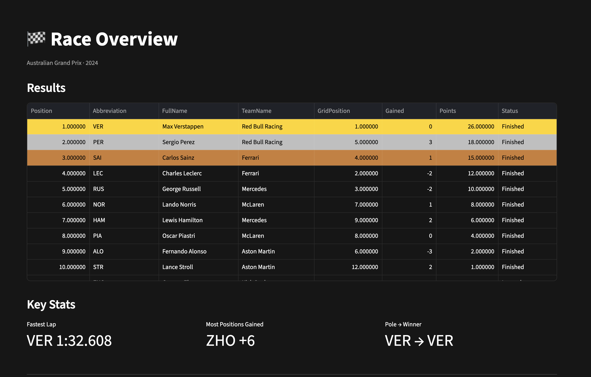
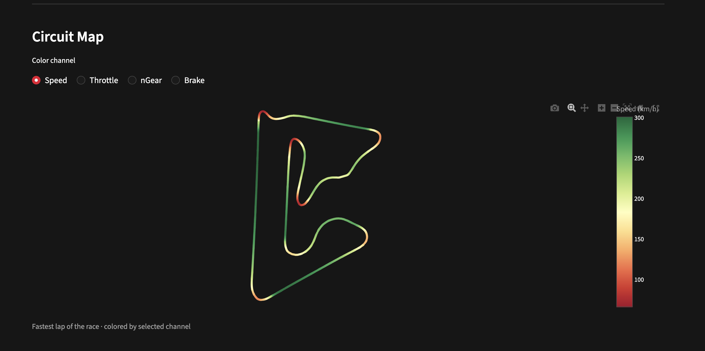

**Driver Duel** — head-to-head lap time comparison, per-sector delta heatmap, and a full telemetry overlay (Speed, Throttle, Brake) across the circuit distance.

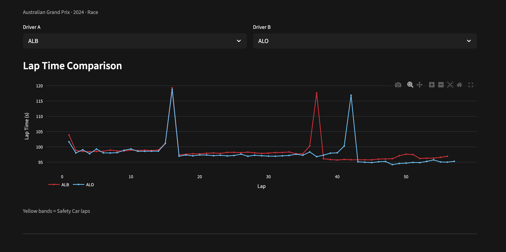
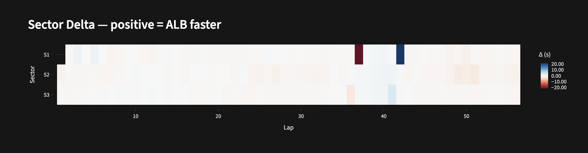
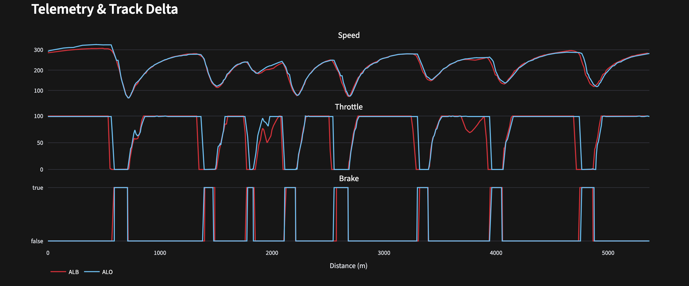

**Tire Strategy** — full-field stint Gantt timeline showing every driver's compound choices, followed by per-stint degradation regression with pit window estimates.

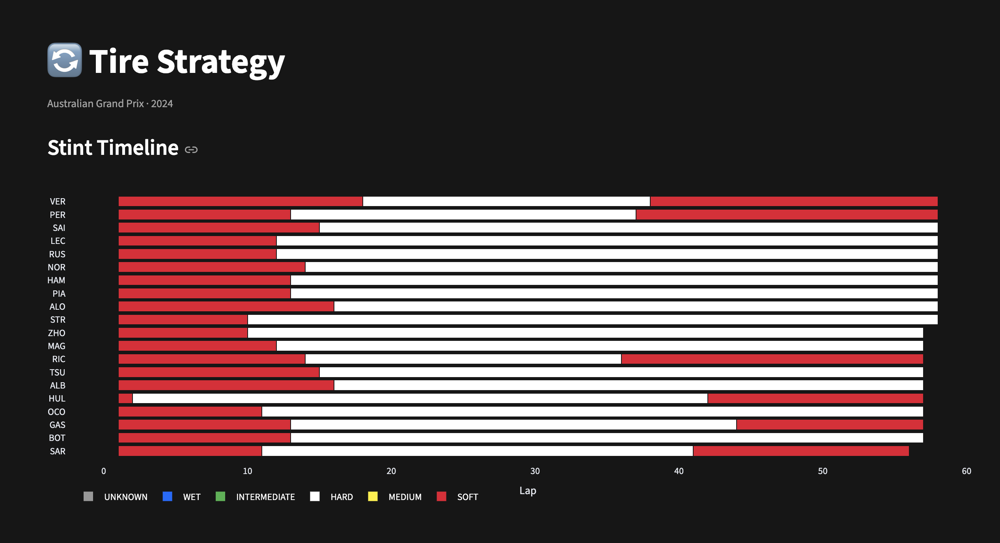
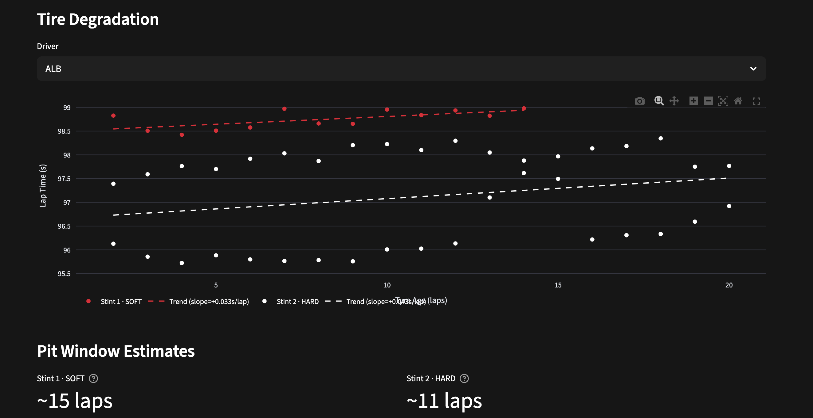

**Anomaly Detection** — z-score flagged lap timeline (pit stops, safety car laps, anomalies colour-coded) and a race control event log.

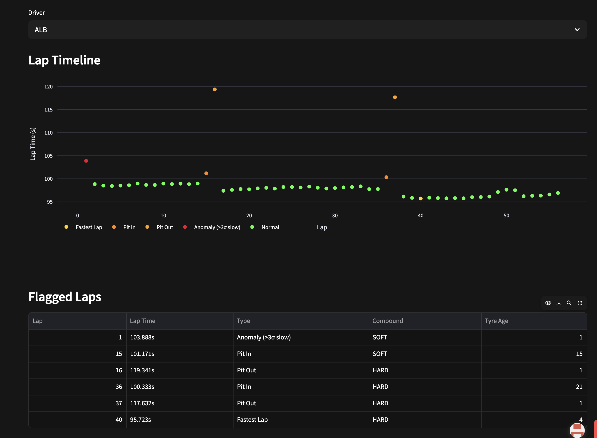
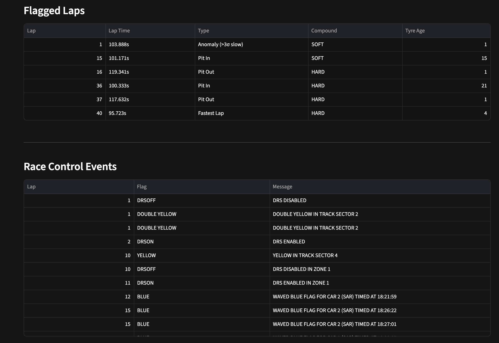

**Season Dashboard** — cumulative points progression across all rounds, and a full-season finishing position heatmap (green = P1, red = P20) across all drivers and rounds.

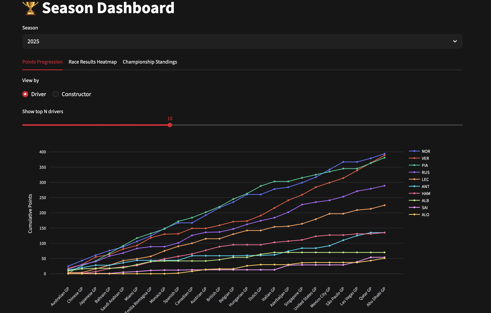
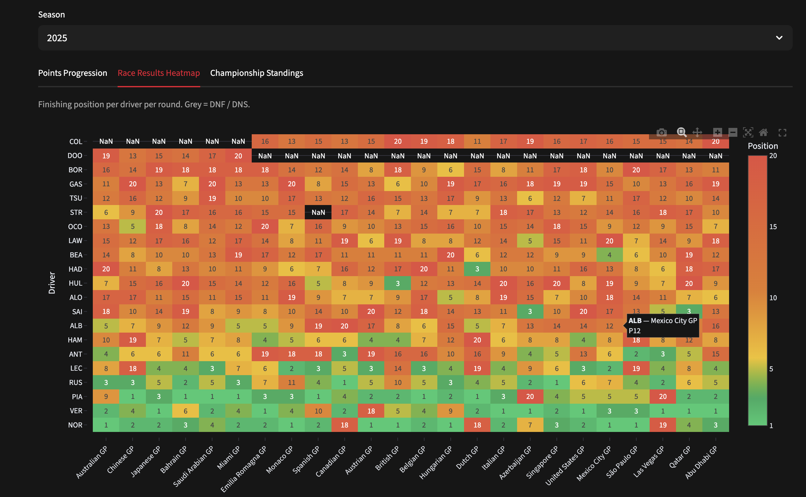

**AI Race Engineer** — context-grounded chat powered by Groq Llama 3.3 70B, with suggested starter questions.

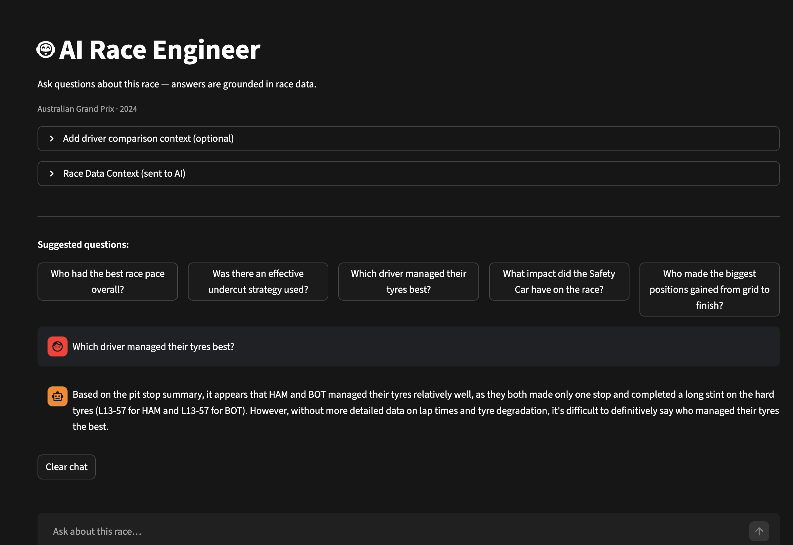

## Tech Stack

| Layer | Tools |
|---|---|
| Data ingestion | FastF1, OpenF1 |
| Storage | DuckDB |
| Visualization | Plotly, Streamlit |
| ML / Analysis | scikit-learn, scipy |
| AI | Groq API (Llama 3.3 70B) |

## Architecture

```
┌─────────────────────────────────────────────────────────────────┐
│                         Data Pipeline                           │
│                                                                 │
│  FastF1 API ──► fetch_data.py ──► DuckDB (f1.duckdb)           │
│                      │            ├── race_results              │
│                      │            ├── lap_data                  │
│                      │            ├── weather_data              │
│                      │            ├── race_control              │
│                      └──► fetch_telemetry.py ──► telemetry      │
└─────────────────────────────────────────────────────────────────┘
                               │
                               ▼
┌─────────────────────────────────────────────────────────────────┐
│                       Analysis Layer                            │
│                                                                 │
│  src/pipeline/db.py        — all DuckDB queries                 │
│  src/analysis/lap_analysis.py   — lap deltas, consistency       │
│  src/analysis/tire_analysis.py  — stints, degradation           │
│  src/analysis/anomaly.py        — z-score flagging, SC laps     │
│  src/analysis/track_map.py      — Plotly circuit/delta maps     │
│  src/ai/race_engineer.py        — context builder + Groq chat   │
└─────────────────────────────────────────────────────────────────┘
                               │
                               ▼
┌─────────────────────────────────────────────────────────────────┐
│                       Streamlit UI                              │
│                                                                 │
│  Home.py          — global session selector (year/round)        │
│  1_Overview.py    — results table, weather chart, speed map     │
│  2_Driver_Duel.py — lap compare, sector heatmap, delta map      │
│  3_Tire_Strategy.py — Gantt timeline, regression, pit window    │
│  4_Anomaly.py     — flagged lap scatter, event timeline         │
│  5_Season.py      — points progression, heatmap, standings      │
│  6_AI_Engineer.py — streaming chat grounded in race context     │
└─────────────────────────────────────────────────────────────────┘
```

**Key design decisions:**

- **Pre-computed telemetry** — fastest-lap X/Y/Speed/Throttle for every driver is stored in DuckDB at ingest time, so circuit maps and driver telemetry overlays load instantly with no API calls at runtime.
- **DuckDB as the single source of truth** — all six pages read exclusively from `f1.duckdb`. No FastF1 imports at page load; no live API calls during user interaction.
- **Stateless pages** — `st.session_state` carries only the selected year/round/session. Every page is independently re-runnable; `importlib.reload()` is applied to all `src.*` modules so Streamlit Cloud never serves stale cached module bytecode.
- **Groq for AI** — Llama 3.3 70B via the Groq free-tier API. The race engineer builds a structured context string from DuckDB (results, stints, anomalies, weather) and injects it as the system prompt, keeping the LLM grounded in actual race data.

## Quick Start

```bash
# 1. Install dependencies
pip install -r requirements.txt

# 2. Fetch race data (downloads and caches sessions locally)
python src/pipeline/fetch_data.py 2024

# 3. Add your Groq API key
echo "GROQ_API_KEY=your_key_here" > .env

# 4. Launch
streamlit run streamlit_app/Home.py
```

## Project Structure

```
F1/
├── src/
│   ├── pipeline/        # Data fetching, session loading, DuckDB queries
│   ├── analysis/        # Lap analysis, tire strategy, anomaly detection, track maps
│   └── ai/              # AI race engineer (Groq API + race context builder)
├── streamlit_app/
│   ├── Home.py          # Landing page + global session selector
│   └── pages/           # One file per tab
├── notebooks/           # EDA and experimentation
└── data/                # Raw and processed data (git-ignored)
```

## Data

Sessions are fetched via FastF1 and persisted to DuckDB. Currently includes 2021–2025 full seasons. Run the fetch scripts to add or update years:

```bash
# Race data: results, lap times, weather, race control events
python src/pipeline/fetch_data.py 2021 2022 2023 2024 2025

# Fastest-lap telemetry per driver (X/Y/Speed/Throttle/Gear/Brake)
python src/pipeline/fetch_telemetry.py 2021 2022 2023 2024 2025

# Qualifying session results and laps (Q1/Q2/Q3)
python src/pipeline/fetch_qualifying.py 2021 2022 2023 2024 2025
```

| Table | Contents |
|---|---|
| `race_results` | Finishing position, points, status per driver per race |
| `lap_data` | Per-lap sector times, compound, tyre life, pit flags |
| `weather_data` | Air/track temp and rainfall sampled throughout each race |
| `race_control` | Safety car, VSC, red flag, and DRS events with lap number |
| `telemetry` | ~1.5 M rows — X/Y/Speed/Throttle/Gear/Brake for every driver's fastest lap |
| `qualifying_results` | Q1/Q2/Q3 best times and grid position per driver |
| `qualifying_laps` | All individual qualifying laps with sector times |

## Season Dashboard

The Season Dashboard provides a full-season view using only the existing `race_results` table — no additional data required.

**Points Progression** — cumulative points per round as a line chart, toggling between Driver and Constructor championship. The top-N slider (5–20) keeps the chart readable across different screen sizes.

**Race Results Heatmap** — a grid of all drivers × all rounds, colored by finishing position (green = P1, red = P20). Drivers are ordered by total season points. Grey cells indicate DNF/DNS or missing data.

**Championship Standings Snapshot** — a round slider lets you freeze standings at any point in the season and compare the driver/constructor tables side-by-side, showing what the championship looked like at that exact moment.

## AI Race Engineer

The AI Race Engineer is a context-grounded chat interface powered by **Groq** (Llama 3.3 70B). It does not rely on the model's training knowledge about races — instead, every question is answered against a structured context block assembled from the current race's DuckDB data.

### How the context is built

Each time you open the page, `build_race_context()` queries DuckDB and assembles a Markdown document injected as the system prompt:

```
# Race: Bahrain Grand Prix 2024
Circuit: Sakhir, Bahrain

## Race Results
P1: VER (Red Bull Racing) — Finished
P2: SAI (Ferrari) — Finished
...

## Weather
Air: 29.4°C avg | Track: 38.7°C avg | Rain: No

## Key Race Control Events
Lap 18: SAFETY CAR DEPLOYED
Lap 21: SAFETY CAR WITHDRAWN

## Pit Stop Summary
VER: SOFT@L1 → MEDIUM@L20 → HARD@L38
SAI: SOFT@L1 → HARD@L22
...

## VER vs NOR  (if two drivers selected)
Average lap delta: 0.312s — VER faster overall
VER consistency: mean 91.847s, std ±0.241s over 48 clean laps
```

### Model and inference settings

| Setting | Value |
|---|---|
| Model | `llama-3.3-70b-versatile` |
| Temperature | 0.3 (factual, low creativity) |
| Max tokens | 512 |
| Streaming | Yes — token-by-token via Groq streaming API |

### What it can answer well

- Pace comparisons and lap delta analysis between any two drivers
- Tire strategy decisions (undercut windows, stint lengths, compound choices)
- Impact of safety car or red flag periods on race outcomes
- Consistency and degradation trends across stints
- Position changes relative to grid start

The system prompt instructs the model to cite specific lap numbers and time deltas, use F1 terminology, and explicitly say when the provided data is insufficient to answer.

## Disclaimer

This project is unofficial and is not associated with Formula 1, Formula One Management (FOM), the FIA, or any F1 team. All F1-related data is sourced via [FastF1](https://github.com/theOehrly/Fast-F1), which accesses publicly available timing data. This project is intended for personal and educational use only and must not be used for commercial purposes.

AI-generated analysis from the Race Engineer feature is based on structured telemetry data and should not be taken as authoritative or official race commentary. Results may contain inaccuracies.
